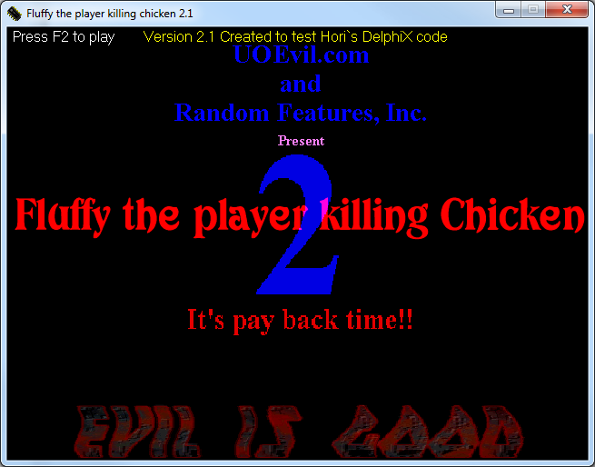

# Fluffy
This is the very first game I ever wrote. I started the first version of fluffy some time in early 1998. 
The game was really just to poke fun at Ultima Online. Somewhere over the years I lost the source code to Fluffy 1.0, but I can offer you a look at 2 and 3. Both project have a zip file including the original exe if you want to have a look.

## Fluffy II 

Fluffy II was still a pretty simple game. Improvements over Fluffy I included the main character launching fireballs at the enemy and the enemy moving in small circles to be harder to hit. 

## Fluffy III 

Fluffy III added:
* multiple different spells
* a large varity of enemies
* enemy animation
* Game Leves or stages
* Boss fights
* Opening and Ending credits and animations. 

## Map 
This is the editing tool I used to build the game maps in Fluffy III
